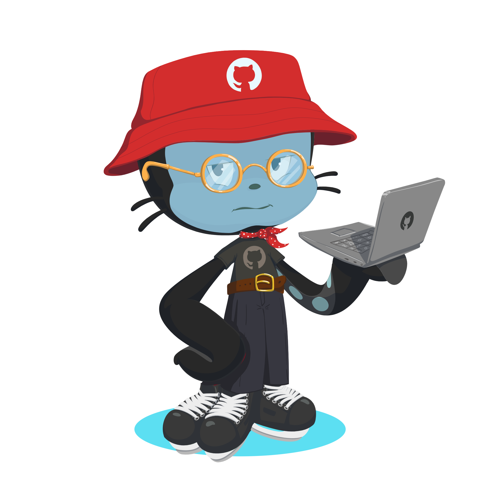

<h1 align="center">Hey dude, I'm Danial Haj Hashem Khani 👋</h1>

  

<h2 align="center">My skills</h2>

  <!-- Front-End Skills -->
  
  
  
  
  
  
  
  

  <!-- Design & Tools -->
  
  
  
  

<h2 align="center">🧑‍💻 Front-End Developer & UI/UX Designer 🎨</h2>

<h3 align="center">
⚡ Clean code is my priority — I care about readability, maintainability, and quality in every project.
</h3>

  

